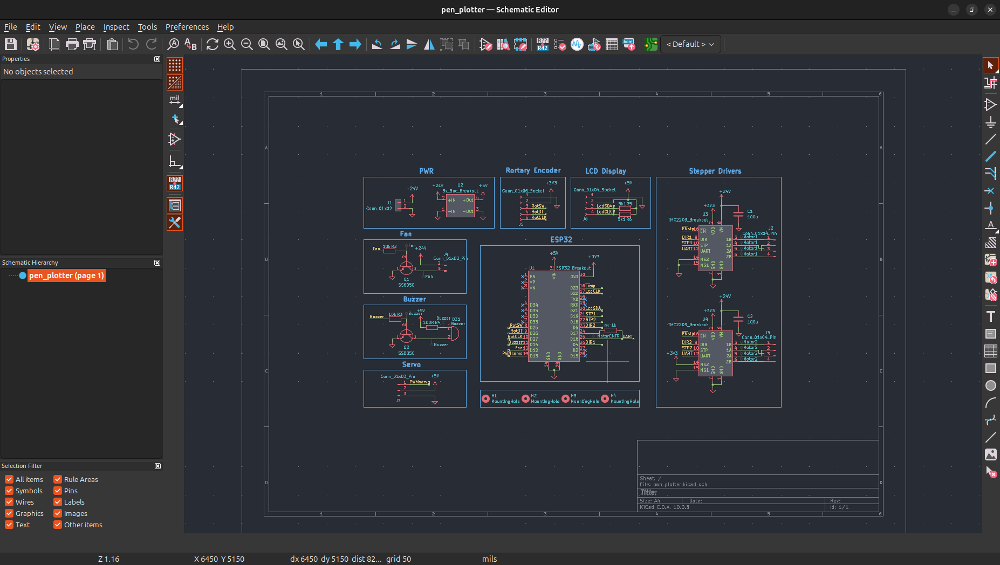
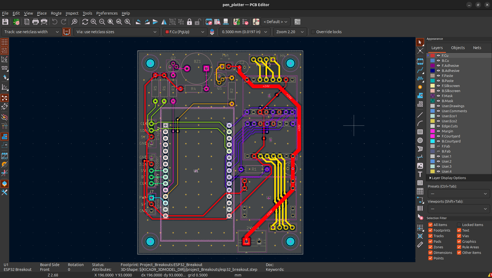
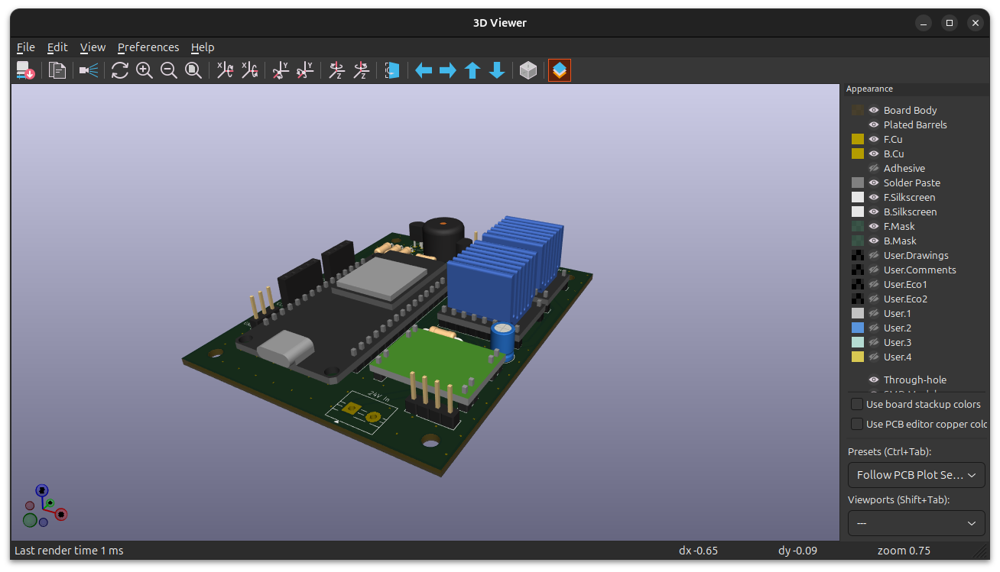

# Pen Plotter Controller Board

A custom PCB controller for a DIY pen plotter, designed in KiCad. The board drives two stepper motors for XY movement, a servo for pen lift, and handles all user interface and power management on a single board.

## Features

- **ESP32** microcontroller (breakout soldered onto PCB) for motion control and logic
- **2× TMC2209** stepper motor drivers (breakouts soldered onto PCB) with UART configuration support
- **SG90 servo** for pen up/down control
- **Buzzer** for audio feedback
- **Fan** driven via transistor for driver cooling
- **I2C LCD display** via connector
- **Rotary encoder** via connector for manual control
- **5V buck converter** (breakout soldered onto PCB) for onboard 5V power rail
- **24V DC input** from external transformer

## Board Overview

### Schematic

### PCB Layout

### 3D View

## Power Architecture

| Rail | Source | Consumers |
|------|--------|-----------|
| 24V | External transformer (DC jack) | TMC2209 motor voltage, fan |
| 5V | Buck converter breakout | ESP32, servo, buzzer, LCD |
| 3.3V | LDO of ESP32 | TMC2209 logic voltage, Rortary encoder|

## Hardware

| Component | Description |
|-----------|-------------|
| ESP32 | Main microcontroller, Wi-Fi/BT capable |
| TMC2209 (×2) | Stepper drivers with UART, stealthChop, stallGuard |
| SG90 | Servo for pen lift mechanism |
| Buck converter | 24V → 5V step-down |
| LCD | I2C character or graphic display |
| Rotary encoder | For manual jog / menu navigation |
